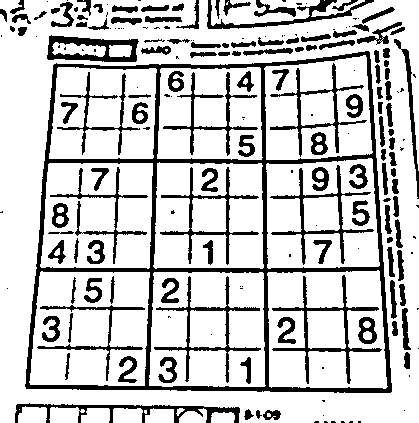
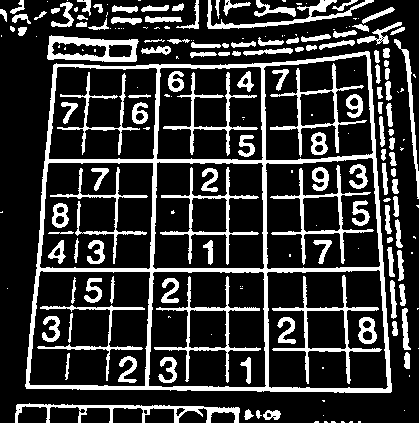
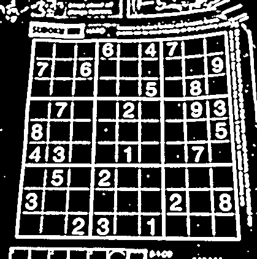
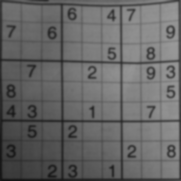

# COMP4102_Project
## Summary
The goal of this project is to build a cross-platform mobile application that can solve a sudoku puzzle given an unsolved image of the puzzle. The user will be able to take a picture of a sudoku puzzle of their choosing and get a visual representation of the solution in the application. 

## Background
As mentioned above, the goal of this project is to build a cross-platform mobile application that can solve a sudoku puzzle by just taking a picture of the sudoku puzzle. Having a sudoku solver can be extremely helpful for people who might be stuck on a sudoku puzzle and would like to see the solution. This would be easy to do if the puzzle was digital but a lot of people do sudoku puzzles found in newspapers or other physical medium. Manually converting  a puzzle from a physical medium to the digital medium such a sudoku solving website can be time consuming. Having a mobile application that a user can use to quickly snap a picture of a puzzle and have the application show the solution to that puzzle would be one of the best solutions for this problem.

## Project Plan
Building a mobile application can be done by using a mobile development framework such as React Native. It is a framework that can build applications with React. React is a Javascript library used to build user interfaces. Using React Native reduces the amount of coding required to build the application for both iOS and Android. Other tools for building mobile applications were considered such as: Ionic, Flutter, and Standard iOS SDK/ Android SDK but these were not selected as it did not facilitate the needs of our project, and/or would not allow us to complete the development process within the project timeframe.

The computer vision aspect of our project relies on the use of the OpenCV library. OpenCV is written in C++, and ported to Python. In order to make OpenCV functional on the mobile application, the team will need to use an adapter class, or different library to interface with OpenCV. Various operations from the OpenCV library will be needed to be performed in order to make the application functional, the following sections will talk about some of these functions.

## The Challenge
Given the goal, this project can be broken down into four problems. First, is locating the puzzle’s edges regardless of perspective. Next, convert the detected puzzle into a flat square image. Also, the application needs to detect the value and position of each cell in the puzzle. Finally, solve the puzzle (probably via backtracking) and display the completed puzzle on screen.

To solve the first problem we can use techniques like edge detection or invert the light and dark pixels. However, a drawback to this approach is not knowing what the contents of the picture is. If the puzzle is only a small part of the picture, scanning for the numbers and grid is very challenging. To solve this, we can detect the boundaries of the puzzle and scan only within those given coordinates. An algorithm we can use it the Hough transform, which can be used to detect straight lines in an image.

After scanning the puzzle, we can now begin the process of converting the image into a flat square image, which can be done through OpenCV functions such as wrapPerspective and the perspectiveTransform.

The problem of extracting the numbers from the filled out squares can be done by checking each box and applying the MNIST Dataset to recognize the digits found inside. Now that we have the puzzle and the location of all digits in the puzzle, we can create a representation of the sudoku board in memory and apply a backtracking algorithm. Once we have solved the puzzle, we can return the solved puzzle back to the user for them to view. 

There might be few other challenges that we will have to overcome, this includes dealing with situations which may include any of the following:
- There is variable lighting in the provided image.
- There is too much extra noise in the image.
- The image is not sharp or the image is blurry. 
- The image is rotated or flipped.

In order to deal with these issues, multiple OpenCV image operations might be needed to be performed such as increasing or decreasing brightness, contrast, sharpness, blur and other operations such as edge detection and corner detection on the supplied image. If the provided image is unusable the user will have to retake the image.

Another challenge we might face is incomplete puzzles, we cannot always assume that the user will provide us with a clean sudoku puzzle. This means that we have to detect which numbers the user has inputted and which numbers were part of the original puzzle. However, this may prove to be too challenging so we may not be able to tackle this challenge in the provided timeline. A possible solution to this however could be by combining the a machine learning model trained using the MNIST dataset and one trained on the SVHN dataset. The SVHN dataset can help identify computer printed digits. We can use these two models to detect all numbers in the puzzle and then use the one with the higher confidence rating to see if it is written by the user or printed by a computer. Additionally, validating if the puzzle is solvable or not provides another dimension of complexity to the application.

## Approach
In the frontend, the user opens the app and captures an image of the sudoku puzzle, this puzzle is then sent to Google Cloud Storage, which triggers a Cloud Function in the backend.

In the backend of the application, numerous OpenCV operations are performed in order to preprocess the image and get it ready for text detection. First, the original image is loaded and converted to greyscale. This way we only have one channel to worry about and a lot less processing. After the image is loaded, it is then blurred by OpenCV’s GaussianBlur() function, which removes the noise and unwanted pixels as illustrated in Figure 1.  

The next step is to remove the grey, meaning removing everything that is not important. For example, the shadow, the background color of each grid, and any details around the puzzle. This is illustrated in Figure 2 using adaptive thresholding, the main features of the puzzle are extracted. 

The puzzle is then inverted, illustrated in Figure 3 so that the gridlines have a non-zero value, this is due to the choice of OCR engine. 

In Figure 3, some of the grid lines do not appear as a line and have a few breaks. Making all the white pixels thicker with a dilation method, most likely, will make most of the grid lines visible with no breaks, as seen in Figure 4 [3]. 

Dilation is the last step to the pre-processing, and the next step is to find the actual puzzle and warp the perspective. Finding the puzzle is done by gathering all the corners in the pre-processed image. A sudoku puzzle is always a large square, with 81 smalls ones inside it. Therefore, finding the largest polygon in the image is also finding the puzzle. To find the largest puzzle, a contouring approach is used with OpenCV’s findContours() [4]. The function findContours() returns a list containing a list of points. This list is then sorted by the area of the contours in descending order. Meaning that the largest polygon is the first element in the sorted list of contours with the largest area. Finally, iterating over the points in the polygon’s contours is needed to find the four corners of the square. The top left is found by getting the smallest x - y value of the point.  The top right is found by getting the largest x - y value of the point. Similarly, the bottom left is found by getting the smallest x + y value of the point. The bottom right is found by getting the largest x + y value of the point. With these coordinates, the original image can be cropped and warped. OpenCV’s warpPerspective() and getPerpectiveTransform() made this simple, and the puzzle then looks like Figure 5. 

After finding the boundaries of the puzzle, the actual values in the puzzle need to be put into memory in the form of a 2-dimensional list of integers. To do this we need to infer the grid, which is done by simply taking the image and dividing the rows and columns by nine, and then placing each sub-image into a list of size 81. The list reads left-right instead of top-down. 

Each sub-image of the puzzle is put through the same preprocessing at the beginning and then fed to the OCR engine. As machine learning is not part of this course, achieving a classification model with similar accuracy to the OCR engine used with the knowledge from this course, it is unlikely to be achieved within the time provided for this project. That is the main reasoning for using Tesseract, Google’s OCR engine. 
Once all the sub-images have been recognized, they are put into a 2-dimensional array, to then be solved, and returned. The approach used to solve the puzzle was a brute-force method. The algorithm puts a number that does not exist in the row, column, and grid. It will then continue to the next position. If no number can fit in that position, the algorithm must back-track to the errored position, increment the value, and continue forward. Once every position is filled then the algorithm is completed.

Some of the resources that we need to solve and overcome some of these challenges can be seen in the Project Resources section below.

## Edge Cases
There are certian cases in which the Tesseract OCR engine might incorrectly identify digits such as '8' to a 'B' or '9' as 'g'. This is due to the fact that the version of Tesseract used does not support limiting the recognized characters to just numbers (whitelisting characters is not supported with the LSTM model). This can be fixed in the future by updating the OCR version once the incompatibility issues are resolved. Currently, if one of these edge cases are hit during the solving process, the solving process will fail. 

## Video Presentation/Demo

## Project Resources
The following are links to resources that we have identified that will be essential to complete this project:
1. "How does it all work?", Sudokugrab.blogspot.com, 2020. [Online]. Available: http://sudokugrab.blogspot.com/2009/07/how-does-it-all-work.html . [Accessed: 30- Jan- 2020].
2. P. Transform, "Perspective Transform", Opencvexamples.blogspot.com, 2020. [Online]. Available: http://opencvexamples.blogspot.com/2014/01/perspective-transform.html . [Accessed: 30- Jan- 2020].
3. "ShounakA/cpp-sudoku-solver", GitHub, 2020. [Online]. Available: https://github.com/ShounakA/cpp-sudoku-solver . [Accessed: 30- Jan- 2020].
4. A. Rosebrock, "OpenCV OCR and text recognition with Tesseract - PyImageSearch", PyImageSearch, 2020. [Online]. Available: https://www.pyimagesearch.com/2018/09/17/opencv-ocr-and-text-recognition-with-tesseract/ . [Accessed: 30- Jan- 2020].
5. U. Native, "Use python libraries in React Native", Stack Overflow, 2020. [Online]. Available: https://stackoverflow.com/questions/47806024/use-python-libraries-in-react-native . [Accessed: 30- Jan- 2020].
6. "How to Use OpenCV in React Native for Image OpenCV Processing - Blog Brainhub.eu", Blog Brainhub.eu, 2020. [Online]. Available: https://brainhub.eu/blog/opencv-react-native-image-processing/ . [Accessed: 30- Jan- 2020].
7. "brainhubeu/react-native-opencv-tutorial", GitHub, 2020. [Online]. Available: https://github.com/brainhubeu/react-native-opencv-tutorial . [Accessed: 30- Jan- 2020].
8. "Build a Multi-Digit Detector with Keras and OpenCV", Medium, 2020. [Online]. Available: https://towardsdatascience.com/build-a-multi-digit-detector-with-keras-and-opencv-b97e3cd3b37 . [Accessed: 30- Jan- 2020].

## Project Setup
Note: Make sure you have [Nodejs](https://nodejs.org/en/) installed, [Expo](https://expo.io/) app installed on the mobile device.
1. Navigate to the /SudokuCNS folder.
2. Enter: `npm install` - this will download and install the dependencies.
3. Enter: `npm start` - this will launch an expo server that you can use to test the application.
4. Scan the barcode that is displayed using your mobile device, this should launch the app on your device.
